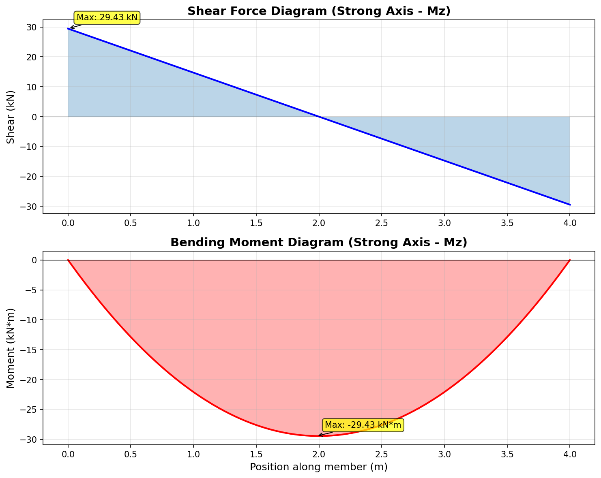

# Mezzanine Structural Design

**Author:** Carter Frostad | **Date:** 2025-12-14 | **Ver:** 1.0

---

Design based on CSA S16 (LSD). Loads extracted from NBCC 2020.

## Design Loads

**Total Factored Load:** 117.72 kN

## Beam Selection (FEA Verified)

Selected **C8X18.75** based on FEA results.

**Max Factored Shear (Vf):** 29.43 kN

*Shear and Moment Diagrams*

### Design Check: C8X18.75

**1. Design Variables**

$$
\begin{aligned}
F_y = 250 \text{ MPa} & \quad E = 200000 \text{ MPa} \\
Z_x = 228000 \text{ mm}^3 & \quad S_x = 180000 \text{ mm}^3 \\
r_y = 15.2 \text{ mm} & \quad r_{ts} = 20.3 \text{ mm} \\
J = 1.81e+05 \text{ mm}^4 & \quad h_o = 193.0 \text{ mm} \\
L_b = 4.00 \text{ m} & \quad C_b = 1.00 \\
\end{aligned}
$$

> *Inputs collected from AISC Database and Material Standards.*

**2. Plastic Moment Capacity (Mp)** *[AISC Eq. F2-1]*

$$
M_p = F_y \cdot Z_x \\
M_p = (250 \text{ MPa})(228000 \text{ mm}^3) (10^{-6}) \\
\rightarrow \mathbf{57.00 \text{ kNm}}
$$

> *This is the theoretical maximum capacity of the section.*

**3a. Compact Limit Length (Lp)** *[AISC Eq. F2-5]*

$$
L_p = 1.76 r_y \sqrt{\frac{E}{F_y}} \\
L_p = 1.76 (15.2 \text{ mm}) \sqrt{\frac{200000}{ 250 }} \\
\rightarrow \mathbf{0.76 \text{ m}}
$$

> *If unbraced length is less than this, M_n = M_p.*

**3b. Elastic Limit Length (Lr)** *[AISC Eq. F2-6]*

$$
L_r = 1.95 r_{ts} \frac{E}{0.7 F_y} \sqrt{ \frac{J c}{S_x h_o} + \sqrt{ (\frac{J c}{S_x h_o})^2 + 6.76 (\frac{0.7 F_y}{E})^2 } } \\
L_r = 1.95 (20.3) \frac{200000}{0.7(250)} \sqrt{ 0.0052 + \sqrt{ (0.0052)^2 + 6.76 (\frac{0.7(250)}{200000})^2 } } \\
\rightarrow \mathbf{4.72 \text{ m}}
$$

> *If unbraced length exceeds this, the beam fails by elastic buckling.*

**4. Slenderness Classification**

$$
L_p \text{ vs } L_b \text{ vs } L_r \\
0.76 \text{ m} \text{ vs } \mathbf{4.00 \text{ m}} \text{ vs } 4.72 \text{ m} \\
\rightarrow \mathbf{Check Zone}
$$

> *We compare the actual unbraced length to the calculated limits.*

**5. Nominal Strength (Inelastic LTB)** *[AISC Eq. F2-2]*

$$
M_n = C_b \left[ M_p - (M_p - 0.7 F_y S_x) \left( \frac{L_b - L_p}{L_r - L_p} \right) \right] \le M_p \\
M_n = 1.0 \left[ 57.0 - (57.0 - 0.7(250)(180000)10^{-6}) \left( \frac{4.00 - 0.76}{4.72 - 0.76} \right) \right] \\
\rightarrow \mathbf{36.14 \text{ kNm}}
$$

> *Therefore, the capacity is reduced from the plastic moment based on the unbraced length.*

**6. Design Strength (LRFD)**

$$
\phi_b M_n = 0.9 M_n \\
0.9 (36.14) \\
\rightarrow \mathbf{\mathbf{32.53 \text{ kNm}}}
$$

> *Therefore, this is the factored moment resistance of the beam.*

### Beam Summary: C8X18.75
> **Status:** ✅ PASS
| Parameter | Value | Unit |
| :--- | :--- | :--- |
| Mn | 36.14 | kN·m |
| Mu_capacity | 32.53 | kN·m |
| Lp | 0.76 | m |
| Lr | 4.72 | m |

## Column Selection

Selected **W6X8.5** for main columns.

### Column Design Check: W6X8.5

**1. Design Variables**

$$
\begin{aligned}
F_y = 350 \text{ MPa} & \quad E = 200000 \text{ MPa} \\
L = 3000 \text{ mm} & \quad A_g = 1630 \text{ mm}^2 \\
r_x = 61.7 \text{ mm} & \quad r_y = 22.6 \text{ mm} \\
K = 1.00 \text{ (pinned-pinned)} & \quad  \\
\end{aligned}
$$

> *Inputs collected from AISC Database and boundary conditions.*

**2. Slenderness Ratio (KL/r)**

$$
\frac{KL}{r} = \max \left( \frac{KL}{r_x}, \frac{KL}{r_y} \right) \\
\max \left( \frac{1.0 \cdot 3000}{61.7}, \frac{1.0 \cdot 3000}{22.6} \right) = \max(48.6, 132.7) \\
\rightarrow \mathbf{132.74 \text{ (Axis Y-Y)}}
$$

> *The column will buckle about this axis first.*

**3. Elastic Buckling Stress (Fe)** *[AISC Eq. E3-4]*

$$
F_e = \frac{\pi^2 E}{(KL/r)^2} \\
F_e = \frac{\pi^2 (200000)}{(132.7)^2} \\
\rightarrow \mathbf{112.02 \text{ MPa}}
$$

> *This is the theoretical Euler buckling stress.*

**4. Buckling Regime Classification**

$$
\frac{KL}{r} \text{ vs } 4.71\sqrt{\frac{E}{F_y}} \\
132.7 \text{ vs } 4.71\sqrt{200000/350} = 112.6 \\
\rightarrow \mathbf{Check Limit}
$$

> *Comparing actual slenderness to the material yield limit.*

**Classification: Elastic Buckling**

$$
\frac{KL}{r} > 4.71\sqrt{\frac{E}{F_y}} \\
\rightarrow \mathbf{\text{Regime: Elastic (Slender Column)}}
$$

> *The column behaves like a classic Euler column.*

**5. Critical Stress Calculation** *[AISC Eq. E3-3]*

$$
F_{cr} = 0.877 F_e \\
F_{cr} = 0.877 (112.02) \\
\rightarrow \mathbf{98.24 \text{ MPa}}
$$

> *Capacity is reduced to 87.7% of the theoretical Euler stress.*

**6. Nominal Compressive Strength** *[AISC Eq. E3-1]*

$$
P_n = F_{cr} A_g \\
P_n = (98.24 \text{ MPa})(1630 \text{ mm}^2)(10^{-3}) \\
\rightarrow \mathbf{160.14 \text{ kN}}
$$

> *Therefore, this is the unfactored capacity.*

**7. Design Compressive Strength (LRFD)**

$$
\phi_c P_n = 0.9 P_n \\
0.9 (160.14) \\
\rightarrow \mathbf{\mathbf{144.12 \text{ kN}}}
$$

> *Therefore, this is the factored axial capacity.*

### Column Check: W6X8.5
> **Status:** ✅ PASS
| Parameter | Value | Unit |
| :--- | :--- | :--- |
| Pn | 160.14 | kN |
| Pu_capacity | 144.12 | kN |
| Fcr | 98.24 | MPa |
| slenderness | 132.74 |  |
| limit_slenderness | 112.59 | - |
| failure_mode | Elastic Buckling | - |
| governing_axis | Y-Y | - |
| k_factor | 1.00 | - |
| boundary_conditions | ['pinned', 'pinned'] | - |

## Beam-to-Column Connection

Designing shear tab for **C8X18.75** connecting to **W6X8.5**.

**Design Shear Force (Vf):** 29.43 kN

### Check 1: Bolt Shear

**1. Bolt Parameters**

$$
\begin{aligned}
d_b = 20.0 \text{ mm} & \quad Grade: 8.8 \\
F_{ub} = 800 \text{ MPa} & \quad n = 2 \\
V_f = 29.43 \text{ kN} & \quad  \\
\end{aligned}
$$

> *Parameters established for shear check.*

**2. Bolt Area**

$$
A_b = \frac{\pi d_b^2}{4} \\
A_b = \frac{\pi (20.0)^2}{4} \\
\rightarrow \mathbf{314.2 \text{ mm}^2}
$$

**3. Factored Shear Resistance (Per Bolt)** *[CSA S16 Cl. 13.11.2]*

$$
V_r = 0.60 \phi_b A_b F_{ub} m \\
V_r = 0.60(0.80)(314)(800)(1)(10^{-3}) \\
\rightarrow \mathbf{120.64 \text{ kN/bolt}}
$$

> *Capacity per bolt in single shear.*

**4. Total Shear Resistance**

$$
V_{r,total} = n \cdot V_r \\
V_{r,total} = 2 \cdot 120.64 \\
\rightarrow \mathbf{\mathbf{241.27 \text{ kN}}}
$$

**5. Check Utilization**

$$
\frac{V_f}{V_r} \le 1.0 \\
29.43 / 241.27 = 0.122 \\
\rightarrow \mathbf{PASS}
$$

> *The bolts pass in shear.*

### Check 2: Bearing

**1. Bearing Parameters (Fin Plate)**

$$
\begin{aligned}
t = 10.0 \text{ mm} & \quad d_b = 20.0 \text{ mm} \\
F_u = 400 \text{ MPa} & \quad V_f = 14.71 \text{ kN} \\
\end{aligned}
$$

> *Material properties for the Fin Plate.*

**2. Factored Bearing Resistance** *[CSA S16 Cl. 13.12.1.2]*

$$
B_r = 3 \phi_{br} t d F_u \\
B_r = 3(0.80)(10.0)(20.0)(400) 10^{-3} \\
\rightarrow \mathbf{\mathbf{192.00 \text{ kN}}}
$$

> *Maximum load before bolt tears through material (Bearing limit).*

**3. Check Utilization**

$$
\frac{V_f}{B_r} \le 1.0 \\
14.71 / 192.00 = 0.077 \\
\rightarrow \mathbf{PASS}
$$

### Check 3: Block Shear Rupture

**Block Shear Geometry**

$$
\begin{aligned}
A_{gv} = 1364 \text{ mm}^2 & \quad A_{nv} = 955 \text{ mm}^2 \\
A_{nt} = 360 \text{ mm}^2 & \quad U_{bs} = 1.0 \\
\end{aligned}
$$

> *Areas calculated based on bolt layout.*

**Block Shear Capacity** *[CSA S16 13.11 / AISC J4.3]*

$$
T_r = \phi_u [ \min(0.6 F_u A_{nv}, 0.6 F_y A_{gv}) + U_{bs} F_u A_{nt} ] \\
T_r = 0.75 [ \min(229152, 204600) + 143840 ] 10^{-3} \\
\rightarrow \mathbf{261.33 \text{ kN}}
$$

> *Resistance (261.3 kN) vs Load (29.4 kN) -> PASS*

> **Overall Connection Status:** ✅ PASS

> **Critical Mode:** Bolt Shear (0.12)

## Base Plate Design

### Base Plate Analysis for W6X8.5
**Load:** 29.43 kN | **Col:** W6X8.5
**Mat:** ASTM A36 | **Conc:** Concrete 25MPa
#### Plate Geometry
- **B:** 200.000 mm
- **N:** 248.000 mm
- **Area:** 49600.000 mm ** 2

#### Concrete Bearing Resistance (CSA S16)
- **Load (Pu):** 29.430 kN
- **Bearing Stress (q):** 0.593 MPa
- **Allowable Stress (0.85*phi*fc):** 13.812 MPa
- **Ratio:** 0.04295723252079989
- **Status:** PASS

#### Plate Thickness Calculation
- **Cantilever m:** 53.700 mm
- **Cantilever n:** 60.000 mm
- **Critical Length (l):** 60.000 mm
- **t_required:** 4.357 mm
- **t_standard:** 4.760 mm

#### CONCLUSION
> **Status:** PASS
> **Calculated Thickness:** 4.36 mm
> **Purchase Plate:** 200 mm x 248 mm x **4.8 mm**
---

---
*Generated by MechanicalDesignTools*